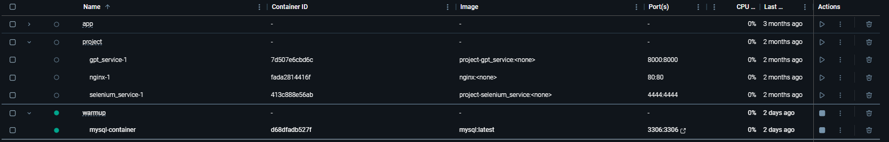
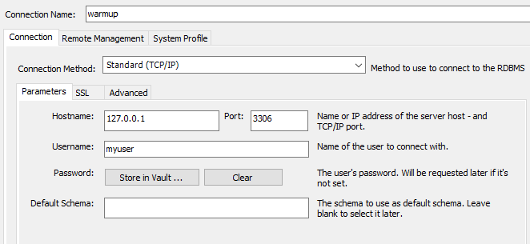

# COMP353-warmup
This is the COMP353 warmup project for TEAM XX
By Luis Ramirez, xxx, xxx, and xxx

# Setup
## Prerequisites:
- Docker Desktop - https://www.docker.com/products/docker-desktop/
- MySQL client - https://dev.mysql.com/downloads/installer/

## Launching Database (Skip if you're connecting to the concordia db)
- Set up the MySQL server instance by running the following command for docker: 
```
docker-compose build
docker-compose down
docker-compose up
``` 
The docker container should be running (see the green light)


## Connecting To Concordia DB
### Connecting to docker container (skip if connecting to concordia DB):
- Open up the MySQL database client, add a connection with the following credentials by going into "Database > Connect to Database":
```
IP: localhost - 127.0.0.1
PORT: 3306
username: myuser
password: mypassword
```
### Connecting to concordia DB
*Ensure you are connected to the concordia VPN*
If you're connecting to the concordia hosted db:
```
IP: uqc353.encs.concordia.ca
port: 3306
username: uqc353_4
password: Aplus123
```


This should allow you to connect into the database. You can now write your own SQL Queries

## Loading Example data into the database
- Copy the contents in `sql/add_data.sql`, and paste it into the SQL query editor of the SQL Client

